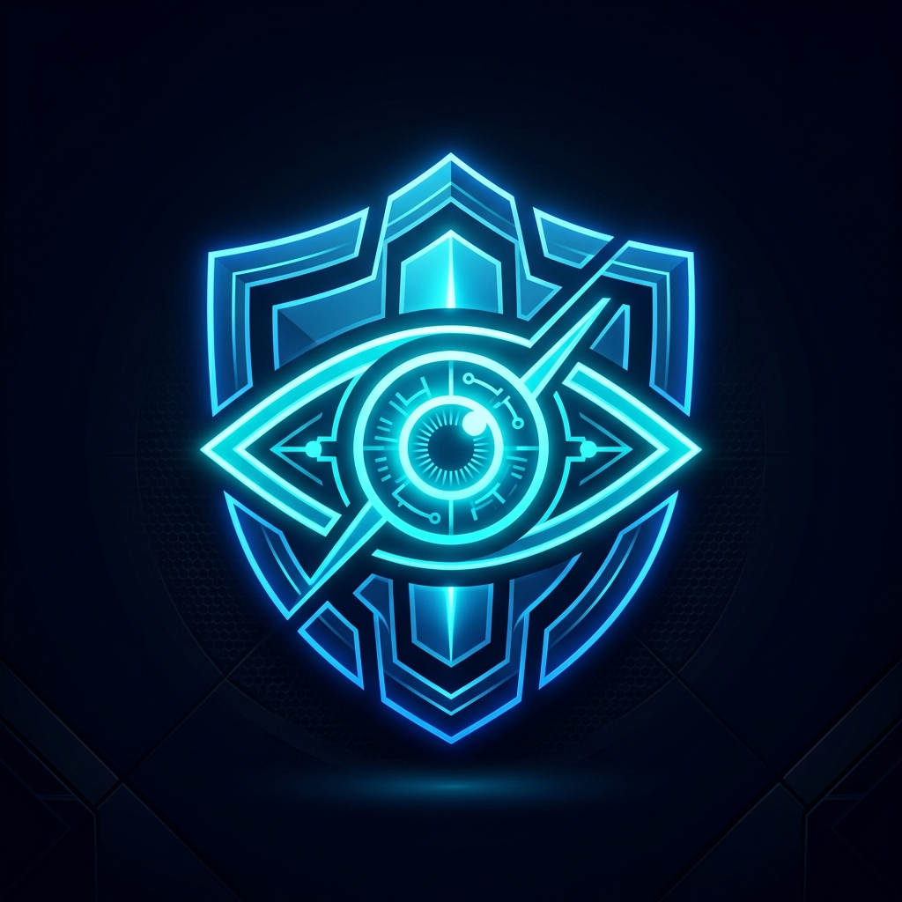

<div align="center">
  
  <h1>Aethra Vision Core</h1>
  <h3>Enterprise-Grade AI CCTV Surveillance & Threat Detection System</h3>
  
  <p>
    
    
    
    
    
  </p>
</div>

---

## ?? Overview

**Aethra Vision Core** is an advanced, AI-powered security pipeline designed for high-risk environments. It leverages state-of-the-art Deep Learning models (YOLO & DeepFace) to analyze real-time RTSP video streams from IP cameras. The system automatically detects lethal threats, tracks suspicious individuals autonomously via PTZ cameras, and pushes zero-latency multimedia alerts directly to security operators.

---

## ?? Key Features

- ?? **Zero-False-Positive Weapon Detection:** Uses heuristic spatial overlap (weapons must intersect with a human bounding box) and consecutive-frame filtering to completely eliminate "ghost" detections.
- ?? **ALPR (Automatic License Plate Recognition):** Asynchronous OCR engine to extract and log license plates without dropping video stream FPS.
- ?? **Autonomous PTZ Tracking:** Automatically commands Hikvision/Dahua cameras to pan and tilt, locking onto active threats with configurable rotation limits to prevent cable snags.
- ?? **Behavioral Analysis:** Detects Violence/Fights, Unattended Luggage, Loitering, and sudden falls.
- ?? **Emotion & Stress Detection:** Integrated DeepFace analysis to detect high-stress emotions (Fear, Anger) from facial crops.
- ?? **Telegram Webhooks:** Instantly pushes annotated threat frames and recorded clip links to a designated Telegram incident channel.
- ?? **Dual-Control (2PI) Governance:** Prevents insider tampering by requiring Two-Person Integrity (authorization from two admins) to purge forensic audit logs.

---

## ??? System Architecture

The project is structured into three highly decoupled microservices:

```text
?? Suspicious-Activity-Detection
 ? ?? ai_pipeline/         # ?? Python AI Engine (YOLO, OpenCV, EasyOCR, DeepFace)
 ? ?? backend/             # ?? FastAPI Server (Central DB, Configs, 2PI Logging)
 ? ?? frontend/            # ?? React + Vite Dashboard (Live Stream, Settings UI)
 ? ?? .gitignore
 ? ?? README.md
 ? ?? start.bat            # ?? One-click startup script
```

---

## ?? Getting Started

### 1. Prerequisites
- **Python 3.10+** (For AI Pipeline & Backend)
- **Node.js 18+** (For Frontend Dashboard)
- GPU with CUDA support (Highly recommended for 30+ FPS YOLO inference)

### 2. Configuration
Before launching, you must configure the `.env` files in each microservice folder:
- `ai_pipeline/.env`: Set `TELEGRAM_BOT_TOKEN`, `CAMERA_RTSP_URLs`, and credentials.
- `backend/.env`: Set `DATABASE_URL` and `SECRET_KEY`.
- `frontend/.env`: Set `VITE_API_URL`.

### 3. Launching the System
We provide a convenient batch script to spin up the entire stack simultaneously on Windows.

```bash
# Clone the repository
git clone https://github.com/sasiruliyanage2004/Suspicious-Activity-Detection.git
cd Suspicious-Activity-Detection

# Launch all microservices
start.bat
```

> **Note:** The `start.bat` script will open three separate terminal windows for the AI Engine, Backend API, and Frontend Vite server.

---

<div align="center">
  <i>Developed for next-generation automated threat detection.</i>
</div>

